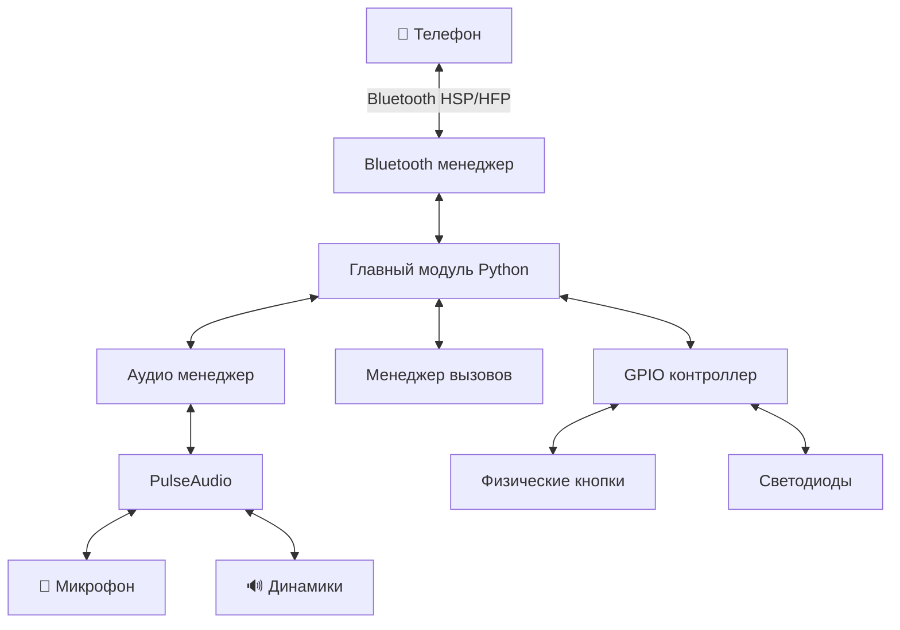
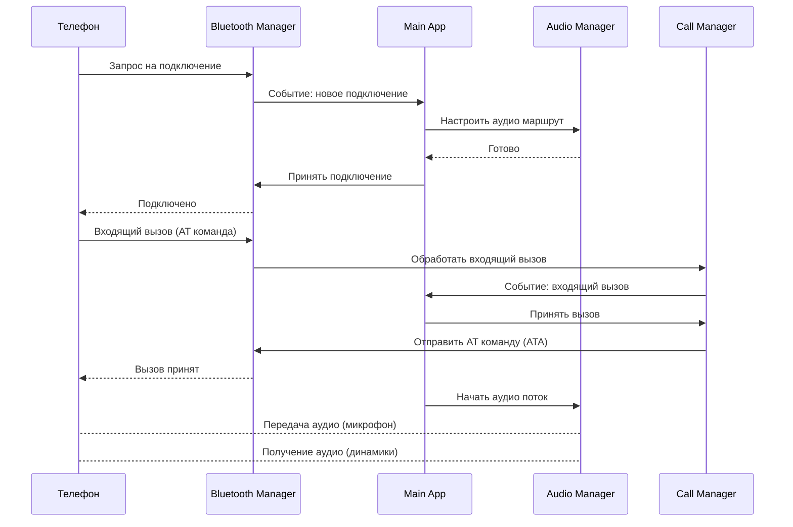

# Техническое задание: Bluetooth гарнитура Hands-Free на Raspberry Pi 4

## 1. Общее описание проекта

### 1.1. Цель проекта
Создание функционального аналога Bluetooth гарнитуры hands-free на базе Raspberry Pi 4, способной подключаться к мобильным телефонам и обеспечивать двустороннюю голосовую связь.

### 1.2. Назначение
- Прием и передача аудио через Bluetooth
- Воспроизведение звука через динамики
- Запись звука через микрофон
- Управление звонками (принять/отклонить/завершить)
- Регулировка громкости

### 1.3. Область применения
- Hands-free устройство для автомобиля
- Беспроводная гарнитура для переговоров
- Прототип для образовательных целей
- База для создания кастомных аудио-устройств

---

## 2. Технические требования

### 2.1. Аппаратное обеспечение

#### Основные компоненты:
| Компонент | Спецификация | Назначение |
|-----------|--------------|------------|
| **Raspberry Pi 4** | Model B, 2GB+ RAM | Основная вычислительная платформа |
| **USB Audio адаптер** | USB Sound Card (3.5mm jack) | Аудио ввод/вывод |
| **Микрофон** | 3.5mm jack или USB микрофон | Захват голоса |
| **Динамики** | 3.5mm jack или USB динамики | Воспроизведение звука |
| **Bluetooth модуль** | Встроенный Bluetooth 5.0 | Беспроводная связь |
| **Кнопки управления** | GPIO кнопки (опционально) | Управление вызовами |
| **Питание** | 5V 3A USB-C | Электропитание |

#### Альтернативные варианты:
- **I2S аудио HAT** (например, HiFiBerry DAC) для улучшенного качества звука
- **USB гарнитура** - упрощенный вариант (микрофон + динамики в одном устройстве)

### 2.2. Программное обеспечение

#### Операционная система:
- **Raspberry Pi OS** (ранее Raspbian) - последняя стабильная версия (Bullseye/Bookworm)
- Базовая установка с графическим интерфейсом или Lite версия

#### Основные технологии:
| Технология | Версия | Назначение |
|------------|--------|------------|
| **Python** | 3.9+ | Основной язык программирования |
| **BlueZ** | 5.55+ | Bluetooth стек для Linux |
| **PulseAudio / PipeWire** | Актуальная | Аудио сервер |
| **ALSA** | Актуальная | Низкоуровневый аудио интерфейс |
| **PyBluez** или **dbus-python** | Актуальная | Python библиотека для Bluetooth |

---

## 3. Функциональные требования

### 3.1. Bluetooth подключение

#### FR-001: Режим обнаружения
- Система должна переходить в режим обнаружения при запуске
- Устройство должно быть видимым для телефонов как "RPi Hands-Free"
- Поддержка автоматического переподключения к известным устройствам

#### FR-002: Профили Bluetooth
Обязательная поддержка следующих профилов:
- **HSP** (Headset Profile) - базовая поддержка гарнитуры
- **HFP** (Hands-Free Profile) - расширенный профиль hands-free
- **A2DP** (Advanced Audio Distribution Profile) - для воспроизведения музыки (опционально)

#### FR-003: Сопряжение
- Поддержка PIN-кода (по умолчанию "0000" или "1234")
- Сохранение списка доверенных устройств
- Автоматическое подключение к последнему известному устройству

### 3.2. Аудио функции

#### FR-004: Захват звука (микрофон)
- Частота дискретизации: 8 kHz или 16 kHz (стандарт для голосовой связи)
- Формат: mono, 16-bit PCM
- Подавление эха (AEC - Acoustic Echo Cancellation) - желательно
- Шумоподавление (опционально)

#### FR-005: Воспроизведение звука (динамики)
- Частота дискретизации: 8 kHz или 16 kHz
- Формат: mono, 16-bit PCM
- Регулировка громкости программно и аппаратно
- Автоматическое усиление (AGC) - опционально

#### FR-006: Маршрутизация аудио
- Автоматическое переключение источника/приемника аудио при подключении
- Поддержка одновременного подключения только одного телефона
- Корректное освобождение аудио ресурсов при отключении

### 3.3. Управление вызовами

#### FR-007: Базовые команды
- Принять входящий вызов
- Отклонить входящий вызов
- Завершить активный вызов
- Повторный набор последнего номера (опционально)
- Голосовой набор (опционально)

#### FR-008: Индикация статуса
- Светодиодная индикация состояния:
  - Ожидание подключения (мигание)
  - Подключено (постоянное свечение)
  - Входящий вызов (быстрое мигание)
  - Активный вызов (медленное мигание)
- Звуковые сигналы для событий (опционально)

### 3.4. Управление устройством

#### FR-009: Кнопки управления (GPIO)
- **Кнопка 1**: Принять/завершить вызов
- **Кнопка 2**: Отклонить вызов
- **Кнопка 3**: Увеличить громкость
- **Кнопка 4**: Уменьшить громкость

#### FR-010: Автозапуск
- Сервис должен автоматически запускаться при загрузке системы
- Восстановление работы после сбоев

---

## 4. Архитектура системы

### 4.1. Компонентная диаграмма



### 4.2. Программные модули

#### Модуль 1: Bluetooth Manager (`bluetooth_manager.py`)
```python
"""
Управление Bluetooth подключением
- Инициализация адаптера
- Режим обнаружения
- Сопряжение устройств
- Обработка профилей HSP/HFP
- Обработка событий подключения/отключения
"""
```

#### Модуль 2: Audio Manager (`audio_manager.py`)
```python
"""
Управление аудио потоками
- Настройка PulseAudio
- Захват с микрофона
- Воспроизведение на динамики
- Маршрутизация аудио потоков
- Регулировка громкости
"""
```

#### Модуль 3: Call Manager (`call_manager.py`)
```python
"""
Управление телефонными вызовами
- Обработка AT команд (HFP)
- Принятие/отклонение вызовов
- Управление активным вызовом
- Индикация статуса
"""
```

#### Модуль 4: GPIO Controller (`gpio_controller.py`)
```python
"""
Управление GPIO (кнопки, светодиоды)
- Обработка нажатий кнопок
- Управление светодиодами
- Debouncing для кнопок
- События для главного модуля
"""
```

#### Модуль 5: Main Application (`main.py`)
```python
"""
Главный модуль приложения
- Инициализация всех компонентов
- Координация работы модулей
- Обработка событий
- Логирование
- Обработка исключений
"""
```

#### Модуль 6: Configuration (`config.py`)
```python
"""
Конфигурация системы
- Параметры Bluetooth
- Аудио настройки
- GPIO пины
- Константы и настройки
"""
```

#### Модуль 7: Logger Setup (`logger_setup.py`)
```
"""
Настройка логирования приложения
- Инициализация логгеров и обработчиков (файл/консоль)
- Форматы и уровень логирования
- Ротация и права доступа на лог-файлы
"""
```

#### Модуль 8: Тесты
```
"""
Набор модульных тестов в каталоге `tests/` покрывает парсинг AT-команд,
аудио и логику ответа на звонок. CI/тестовый пайплайн рекомендуется.
"""
```

Примечание по конфигурации: файл `config.ini` включает параметр `state_dir` —
директорию для хранения состояния и временных файлов (по умолчанию `/var/lib/rpi-handsfree`).

## Implementation status

The repository contains a working, pragmatic implementation focused on core hands-free call handling.

- Implemented:
  - Basic Bluetooth adapter initialization and discoverable mode via BlueZ (using `pydbus` or `bluetoothctl` fallback) (`bluetooth_manager.py`).
  - RFCOMM reader and AT-line parsing for HFP/HSP events (RING, +CIEV/+CIND, +CLCC, +VGS/+VGM) and callback dispatching.
  - Call control: `CallManager` implements `incoming`, `answer`, and `hangup` using AT commands (`ATA`, `AT+CHUP`).
  - Audio routing with PulseAudio (`pulsectl`) including setting BlueZ card profile to `headset_head_unit` and moving SCO source-outputs to a physical mic (`audio_manager.py`).
  - GPIO button handling and LED patterns with debouncing and polling fallback (`gpio_controller.py`).
  - Logging configuration with file/console handlers and a fallback writable state directory (`logger_setup.py`).
  - Persistent local state (volume) stored under `misc.state_dir` (`audio_manager.py`).
  - Unit tests in `tests/` covering AT parsing and basic call logic.

- Partially implemented / planned (not fully automatic or production hardened):
  - Automatic reconnect logic (config contains `reconnect_*` keys but reconnect algorithm is not implemented in `bluetooth_manager.py`).
  - Advanced audio preprocessing: AEC/AGC/noise-reduction flags exist in `config.ini` but audio preprocessing pipeline is not implemented in `audio_manager.py`.
  - Secure storage of Bluetooth pairing keys (not implemented); pairing relies on BlueZ and system agent.
  - Full A2DP usage switching and simultaneous A2DP/HFP management is not fully implemented; `audio_manager` can set profiles but automatic switching logic is limited.

This ТЗ has been updated to reflect the current implementation. For feature requests (AEC, AGC, encrypted key storage, robust auto-reconnect), consider them as next milestones.

### 4.3. Взаимодействие компонентов



---

## 5. Детальная спецификация

### 5.1. Bluetooth профили

#### HSP (Headset Profile)
- Базовая поддержка гарнитуры
- Моно аудио канал
- Простые команды управления

#### HFP (Hands-Free Profile)
Основной профиль для реализации. Включает AT команды:
- `AT+BRSF` - Feature negotiation
- `AT+CIND` - Indicator status
- `AT+CMER` - Event reporting
- `ATA` - Answer call
- `AT+CHUP` - Hang up call
- `ATD` - Dial number
- `AT+VGS` - Speaker volume
- `AT+VGM` - Microphone volume

### 5.2. Аудио конфигурация

#### PulseAudio настройки
```bash
# PulseAudio: автоматическое переключение на Bluetooth HSP/HFP профиль
pactl list cards
pactl set-card-profile <card-id> headset_head_unit

# Для PipeWire + pipewire-pulse используйте аналогичные команды через pw-cli/pactl
```

### 5.3. GPIO схема подключения

| GPIO Pin | Назначение | Схема подключения |
|----------|------------|-------------------|
| GPIO 17 | Кнопка "Ответить/Завершить" | Pull-up, активный LOW |
| GPIO 27 | Кнопка "Отклонить" | Pull-up, активный LOW |
| GPIO 22 | Кнопка "Громкость +" | Pull-up, активный LOW |
| GPIO 23 | Кнопка "Громкость -" | Pull-up, активный LOW |
| GPIO 24 | Светодиод "Статус" | Резистор 220Ω, активный HIGH |
| GPIO 25 | Светодиод "Вызов" | Резистор 220Ω, активный HIGH |

---

## 6. Требования к производительности

### 6.1. Задержка (Latency)
- Общая задержка аудио: < 150 мс
- Задержка обработки команд: < 100 мс
- Время отклика на нажатие кнопки: < 50 мс

### 6.2. Качество звука
- Отсутствие эха при громкости до 80%
- Минимальные искажения при нормальной громкости
- Разборчивость речи: высокая

### 6.3. Надежность
- Время непрерывной работы: > 24 часа
- Автоматическое восстановление при потере соединения
- Обработка всех исключений без аварийного завершения

---

## 7. Безопасность

### 7.1. Bluetooth безопасность
- Использование Secure Simple Pairing (SSP)
- Хранение ключей сопряжения в зашифрованном виде
- Опциональная фильтрация по MAC-адресам

### 7.2. Системная безопасность
- Запуск сервиса от непривилегированного пользователя
- Ограничение доступа к конфигурационным файлам
- Логирование всех действий

---

## 8. План разработки

### 8.1. Этап 1: Подготовка окружения (1-2 дня)
- [ ] Установка Raspberry Pi OS
- [ ] Настройка Python 3.9+
- [ ] Установка необходимых пакетов (BlueZ, PulseAudio, ALSA)
- [ ] Тестирование аудио оборудования
- [ ] Тестирование Bluetooth

### 8.2. Этап 2: Базовая функциональность (3-5 дней)
- [ ] Реализация `bluetooth_manager.py`
  - Инициализация адаптера
  - Режим обнаружения
  - Сопряжение
- [ ] Реализация `audio_manager.py`
  - Захват с микрофона
  - Воспроизведение на динамики
- [ ] Базовая интеграция Bluetooth и аудио

### 8.3. Этап 3: Профиль HFP (3-5 дней)
- [ ] Реализация `call_manager.py`
  - Обработка AT команд
  - Управление вызовами
- [ ] Интеграция с Bluetooth Manager
- [ ] Тестирование вызовов

### 8.4. Этап 4: Управление и индикация (2-3 дня)
- [ ] Реализация `gpio_controller.py`
  - Обработка кнопок
  - Управление светодиодами
- [ ] Подключение физических кнопок и светодиодов
- [ ] Тестирование управления

### 8.5. Этап 5: Интеграция и оптимизация (3-5 дней)
- [ ] Интеграция всех модулей в `main.py`
- [ ] Настройка автозапуска (systemd service)
- [ ] Оптимизация задержек аудио
- [ ] Реализация подавления эха (AEC)
- [ ] Обработка ошибок и исключений

### 8.6. Этап 6: Тестирование и документация (2-3 дня)
- [ ] Комплексное тестирование
- [ ] Написание документации пользователя
- [ ] Создание установочного скрипта
- [ ] Финальная отладка

**Общая длительность: 14-23 дня**

---

## 9. Зависимости и библиотеки

### 9.1. Системные пакеты
```bash
# Обновление системы
sudo apt update && sudo apt upgrade -y

# Bluetooth
sudo apt install -y bluez bluez-tools python3-bluez

# Аудио
sudo apt install -y pulseaudio pulseaudio-module-bluetooth alsa-utils
# Или, при использовании PipeWire вместо PulseAudio:
# sudo apt install -y pipewire pipewire-pulse

# Python и библиотеки
sudo apt install -y python3 python3-pip python3-dev python3-venv

# GPIO
sudo apt install -y python3-rpi.gpio python3-gpiozero

# Дополнительные инструменты
sudo apt install -y git vim htop
```

### 9.2. Python библиотеки
```python
# requirements.txt
pybluez>=0.23
PyGObject>=3.40.0
dbus-python>=1.2.18
RPi.GPIO>=0.7.1
gpiozero>=1.6.2
pulsectl>=20.0.0
pydbus>=0.6.0
```

### 9.3. Опциональные библиотеки
```python
# Для продвинутой обработки аудио
numpy>=1.21.0
scipy>=1.7.0
sounddevice>=0.4.4
webrtcvad>=2.0.10  # Voice Activity Detection
```

---

## 10. Конфигурационные файлы

### 10.1. BlueZ конфигурация
```ini
# /etc/bluetooth/main.conf
[General]
Name = RPi Hands-Free
Class = 0x200404
DiscoverableTimeout = 0
PairableTimeout = 0
Privacy = device

[Policy]
AutoEnable=true
```

### 10.2. Systemd сервис
```ini
# /etc/systemd/system/rpi-handsfree.service
[Unit]
Description=Raspberry Pi Hands-Free Headset
After=bluetooth.target sound.target
Requires=bluetooth.target

[Service]
Type=simple
User=pi
ExecStart=/usr/bin/python3 /home/pi/rpi-handsfree/main.py
Restart=always
RestartSec=3

[Install]
WantedBy=multi-user.target
```

### 10.3. Конфигурационный файл приложения
```python
# config.ini
[bluetooth]
device_name = RPi Hands-Free
device_class = 0x200404
discoverable = true
auto_reconnect = true

[audio]
sample_rate = 16000
channels = 1
format = S16_LE
buffer_size = 2048

[gpio]
button_answer = 17
button_reject = 27
button_vol_up = 22
button_vol_down = 23
led_status = 24
led_call = 25

[misc]
log_level = INFO
log_file = /var/log/rpi-handsfree.log
```

---

## 11. Тестирование

### 11.1. Unit тесты
- Тестирование каждого модуля отдельно
- Проверка обработки исключений
- Валидация конфигурации

### 11.2. Интеграционные тесты
- Тест Bluetooth подключения
- Тест аудио потока (loopback)
- Тест управления вызовами
- Тест GPIO взаимодействия

### 11.3. Системные тесты
- Подключение к реальному телефону
- Тест входящих/исходящих вызовов
- Тест качества звука
- Тест стабильности (длительная работа)
- Тест переподключения после разрыва связи

---

## 12. Известные ограничения и решения

### 12.1. Ограничения

| Проблема | Описание | Решение |
|----------|----------|---------|
| **Задержка аудио** | Bluetooth SCO имеет задержку | Оптимизация буферов, использование низкоуровневых API |
| **Качество звука** | SCO профиль - низкое качество | Использование Wide-Band Speech (16 kHz) вместо Narrow-Band (8 kHz) |
| **Эхо** | Звук из динамика попадает в микрофон | Программное подавление эха (AEC), физическое разнесение микрофона и динамика |
| **Совместимость** | Не все телефоны одинаково поддерживают профили | Реализация fallback на HSP |
| **Энергопотребление** | Raspberry Pi потребляет много энергии | Оптимизация питания, отключение ненужных сервисов |

### 12.2. Рекомендации
- Использовать качественный USB аудио адаптер
- Располагать микрофон подальше от динамиков
- Использовать направленный микрофон
- Регулярно обновлять BlueZ и firmware Raspberry Pi

---

## 13. Дополнительные возможности (Future Work)

### 13.1. Расширенные функции
- [ ] Поддержка A2DP для воспроизведения музыки высокого качества
- [ ] Голосовой ассистент (интеграция с Google Assistant/Alexa)
- [ ] OLED дисплей для отображения информации
- [ ] Запись разговоров
- [ ] Мультиязычная поддержка голосовых подсказок
- [ ] Web-интерфейс для настройки

### 13.2. Улучшения качества звука
- [ ] Продвинутое шумоподавление (Deep Learning)
- [ ] Автоматическая регулировка усиления (AGC)
- [ ] Эквалайзер
- [ ] Пространственный звук

### 13.3. Интеграция
- [ ] MQTT для IoT интеграции
- [ ] REST API для управления
- [ ] Интеграция с умным домом (Home Assistant)

---

## 14. Приложения

### 14.1. Полезные команды

```bash
# Проверка Bluetooth
hciconfig -a
bluetoothctl

# Проверка аудио устройств
aplay -l
arecord -l
pactl list cards

# Тестирование микрофона
arecord -f cd test.wav
aplay test.wav

# Логи Bluetooth
journalctl -u bluetooth -f

# Запуск приложения в режиме отладки
python3 main.py --debug
```

### 14.2. Troubleshooting

| Проблема | Возможная причина | Решение |
|----------|-------------------|---------|
| Устройство не обнаруживается | Bluetooth выключен | `sudo systemctl start bluetooth` |
| Нет звука | Неправильный маршрут | Проверить `pactl list sinks` |
| Эхо | Петля обратной связи | Уменьшить громкость, включить AEC |
| Не подключается | Старое сопряжение | Удалить и заново спарить |

---

## 15. Ссылки и ресурсы

### 15.1. Документация
- [BlueZ Documentation](http://www.bluez.org/)
- [Hands-Free Profile Specification](https://www.bluetooth.org/docman/handlers/downloaddoc.ashx?doc_id=238193)
- [PulseAudio Documentation](https://www.freedesktop.org/wiki/Software/PulseAudio/)
- [Raspberry Pi GPIO](https://www.raspberrypi.org/documentation/hardware/raspberrypi/)

### 15.2. Примеры проектов
- [PiMyLifeUp Bluetooth Audio](https://pimylifeup.com/raspberry-pi-bluetooth-audio/)
- [Balena Sound](https://github.com/balenalabs/balena-sound)

---

## 16. Контакты и поддержка

**Версия документа:** 1.0  
**Дата создания:** 2025-11-19  
**Язык программирования:** Python 3.9+  
**Платформа:** Raspberry Pi 4 Model B  
**Лицензия:** MIT (или на ваше усмотрение)

---

> [!IMPORTANT]
> Это техническое задание является отправной точкой проекта. В процессе разработки возможны изменения и дополнения в зависимости от результатов тестирования и требований пользователя.


